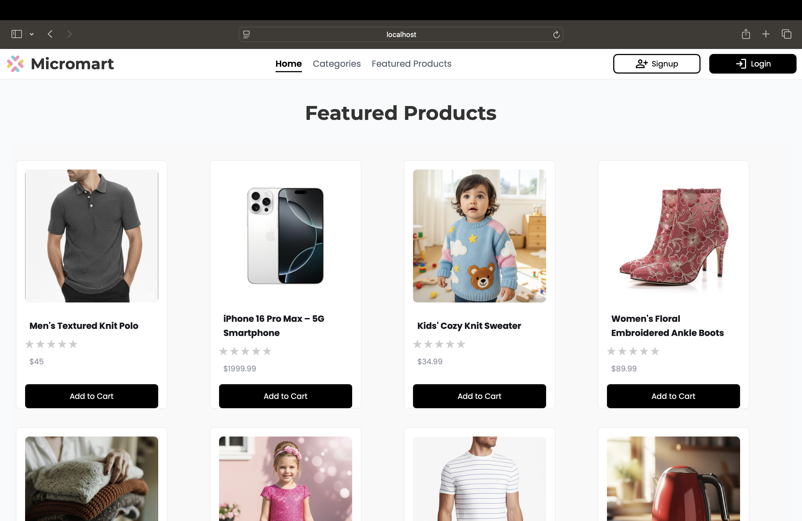
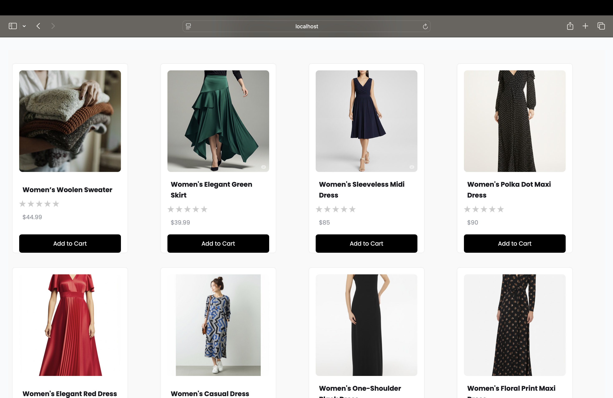
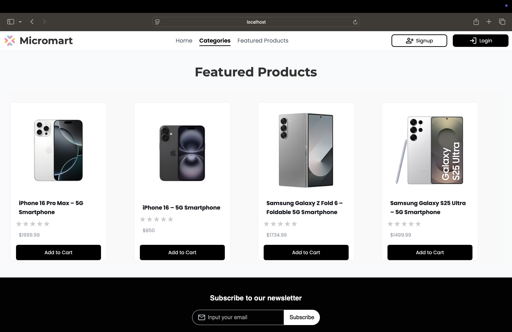
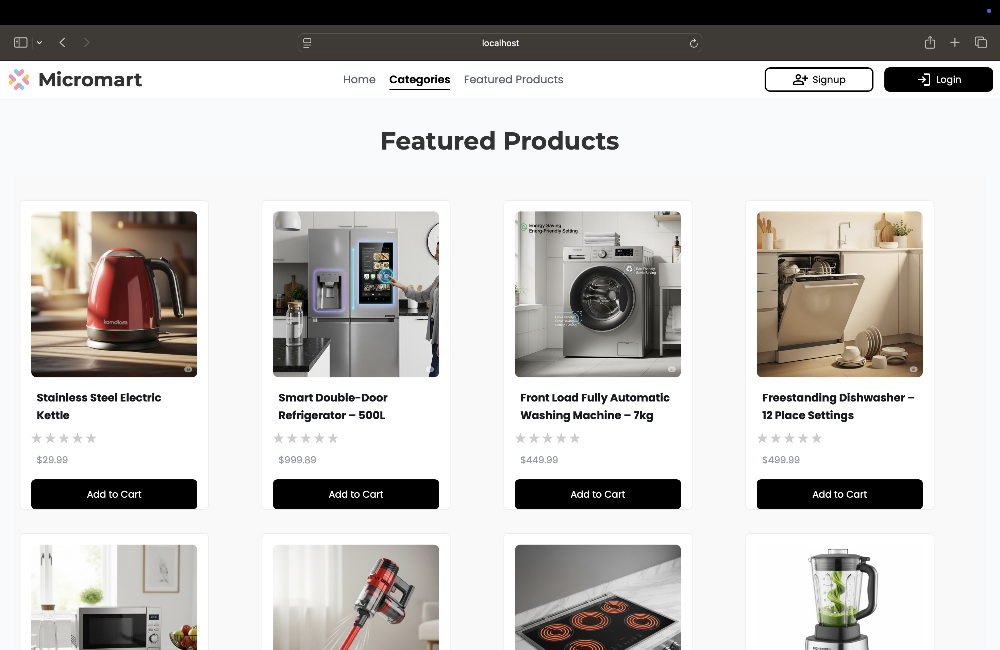
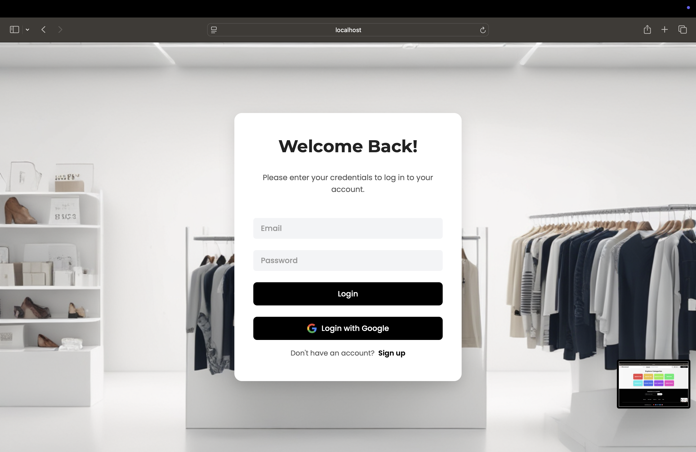
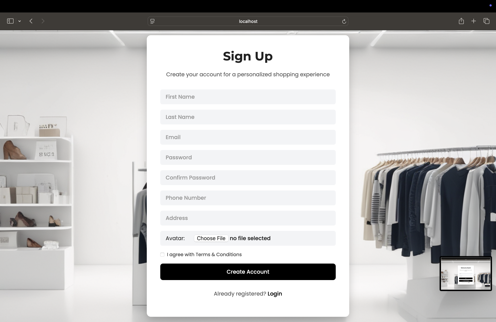
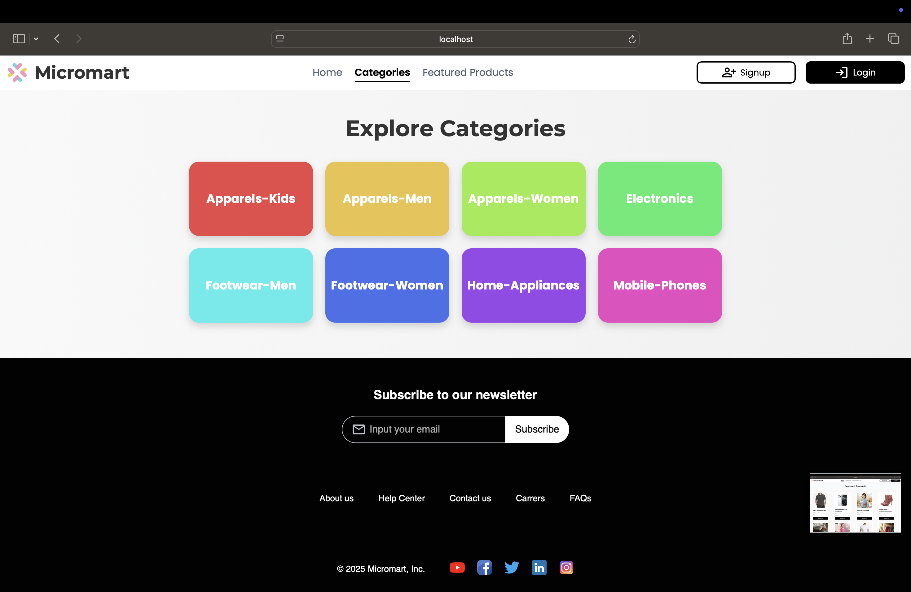
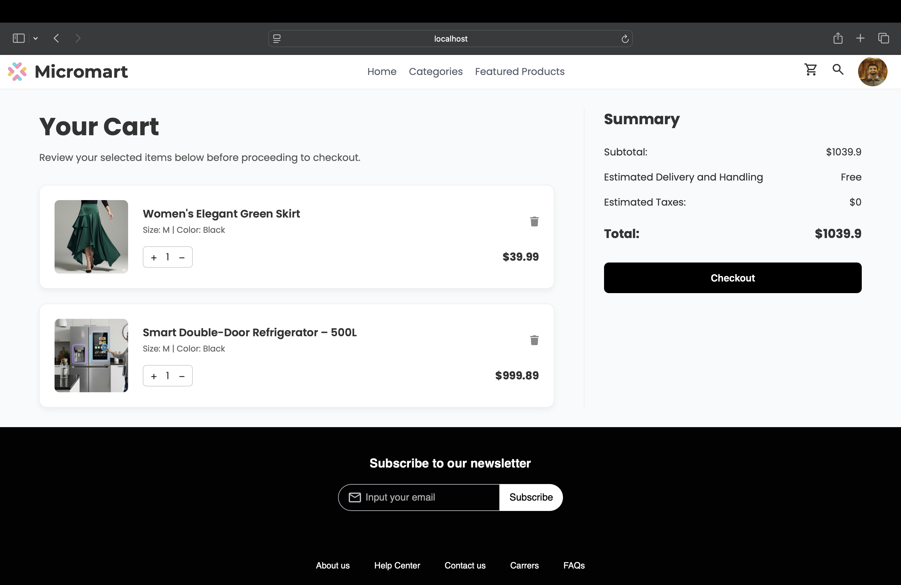
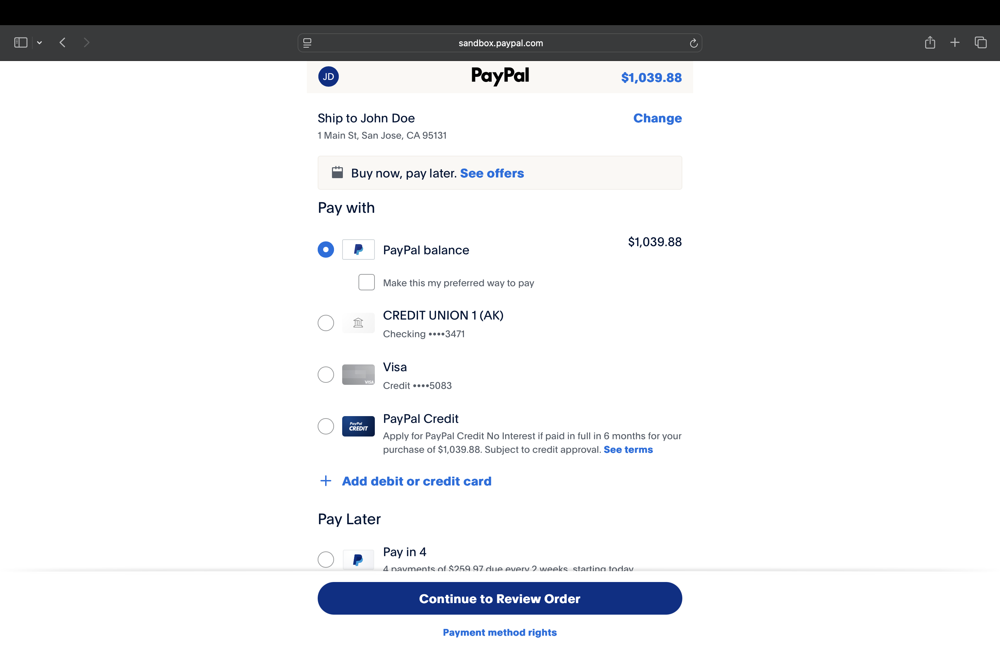
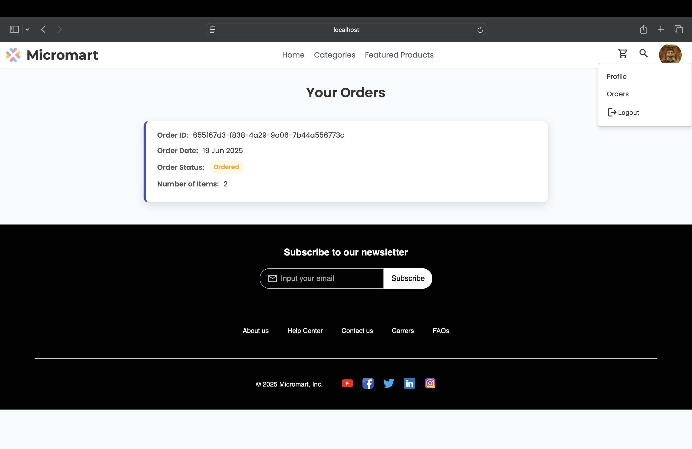

# 🛒 Micromart - eCommerce REST API with Microservices Architecture

Micromart is a modern eCommerce platform built using **Spring Boot microservices** and a **React frontend**.
## 🚀 Tech Stack

### 🧠 Backend
- Spring Boot
- Spring Security
- Spring Data JPA
- MySQL
- Spring Cloud Netflix Eureka
- Spring Cloud Open Feign
- Spring Cloud Gateway
- Cloudinary
- Paypal SDK
- Google Oauth

### 💻 Frontend
- React.js
- Axios
- React Router

## 🧩 Microservices Overview

| Microservice         | Description                                                                   |
|----------------------|-------------------------------------------------------------------------------|
| Gateway              | Acts as a single entry point to route client requests to appropriate services |
| Service Registry     | Registers and discovers microservices using Eureka                            |
| User Microservice    | Manages user registration, login and authentication (via JWT or Google Oauth) |
| Product Microservice | Manages product catalog and categories                                        |
| Review Microservice  | Handles product reviews and ratings from users                                |
| Cart Microservice    | Handles shopping cart operations for users                                    |
| Order Microservice   | Manages user orders and order history                                         |
| Payment Microservice | Initiates and verifies payment transactions for placed orders                 |


## 🔐 Authentication & Authorization

Micromart uses secure and modern authentication mechanisms to protect user data and manage access control.

- **Username & Password Authentication (with BCrypt)**  
  Traditional login system where user passwords are hashed using **BCrypt**, a strong hashing function that adds salt to ensure secure storage and resistance against brute-force attacks.

- **JWT Token-Based Authentication**  
  Upon successful login, a **JWT (JSON Web Token)** is issued, which is used for authenticating protected routes. This ensures stateless and secure user sessions.

- **Google OAuth2 Login**  
  Allows users to log in with their Google accounts using the **OAuth2 protocol**. This provides a secure and user-friendly alternative to manual signups.

[//]: # (- **Role-Based Access Control**  )

[//]: # (  Endpoints are protected based on roles such as `USER` and `ADMIN`, managed through Spring Security.)

## 📦 Features

- ✅ **Microservice-Based Scalable Backend**  
  Built with Spring Boot microservices architecture, allowing independent development, deployment, and scaling of each service.

- ✅ **React Frontend**  
  A modern, responsive user interface built using React.js that communicates with backend services via REST APIs.

- ✅ **Dockerized Deployment**  
  All services and the frontend are containerized using Docker, enabling consistent environments and simplified deployment.

- ✅ **API Gateway Routing**  
  Centralized routing and request forwarding to microservices using Spring Cloud Gateway.

- ✅ **Service Discovery with Eureka**  
  Microservices register themselves with Eureka for dynamic service discovery and load-balanced communication.

- ✅ **JWT Authentication**  
  Secure login with stateless authentication using Spring Security and JWT.

- ✅ **Google OAuth2 Login**  
  Social login support using Google OAuth2 for faster and secure onboarding.

- ✅ **BCrypt Password Hashing**  
  User passwords are securely hashed using BCrypt to protect against brute-force attacks.

- ✅ **PayPal Payment Integration**  
  Secure online payments are supported through **PayPal REST APIs**, allowing users to complete transactions using their PayPal account.

- ✅ **MySQL Database Integration**  
  Reliable relational database support for each microservice using Spring Data JPA.

- ✅ **Cloudinary Image Upload**  
  Product images and user profile pictures are uploaded and stored securely in the cloud using **Cloudinary**, with URLs returned for frontend display.


## 🧪 Run Locally

### ✅ Prerequisites

- Java 17+
- MySQL Server (8.x)
- IntelliJ IDEA (or any Java IDE)
- Node.js & npm (for React frontend)
- A centralized `.env` file in the root `project-micromart/` directory

---

### 📁 Project Structure
<pre>
project-micromart/
│
├── .env # Centralized environment variables
├── ProductMicroservice/
├── UserMicroservice/
├── CartMicroservice/
├── ReviewMicroservice/
├── OrderMicroservice/
├── PaymentMicroservice/
├── Gateway-Microservice/
├── ServiceRegistry/
└── frontend-micromart/
</pre>

### 🔧 Backend Setup (Spring Boot)

1. **Clone the Repository**
```bash
    git clone https://github.com/tyagishubhangam/Project-Micromart.git
    cd Project-Micromart
```
---
2. **Create MySQL Database**\
   ⚠️ Note: In production, each microservice should have its own separate database to ensure loose coupling and independent scaling.
   For development/testing, you can use a single shared database like this:
```sql
CREATE DATABASE micromartDB;
       
/*Recommendation for Production:
CREATE DATABASE product_service;
CREATE DATABASE user_service;
CREATE DATABASE cart_service;
CREATE DATABASE review_service;
CREATE DATABASE order_service;
CREATE DATABASE payment_service;*/
```
---
3. **🛠 Environment Variables**\
    Create a `.env` file in the root of the project based on the below template.
```env
# === Database ===
DATABASE_URL=jdbc:mysql://localhost:3306/your_db_name
DATABASE_USERNAME=your_db_username
DATABASE_PASSWORD=your_db_password

# === Google OAuth2 ===
GOOGLE_OAUTH_CLIENT_ID=your_google_client_id
GOOGLE_OAUTH_SECRET=your_google_client_secret
GOOGLE_CALLBACK_URI=${BASE_URL}/oauth2/callback

# === Cloudinary ===
CLOUDINARY_API_KEY=your_cloudinary_api_key
CLOUDINARY_API_SECRET=your_cloudinary_api_secret
CLOUDINARY_CLOUD_NAME=your_cloud_name

# === Frontend URL ===
FRONTEND_URL=http://localhost:5173 or your frontend URL

# === JWT Secret ===
JWT_SECRET_KEY=your_long_jwt_secret_key

# === PayPal ===
PAYPAL_CLIENT_ID=your_paypal_client_id
PAYPAL_CLIENT_SECRET=your_paypal_client_secret
```
---
4. **▶️ Run Microservices**

Each microservice has a main class (e.g., `ProductMicroserviceerviceApplication.java`) annotated with `@SpringBootApplication`.

To run:
- Open each microservice module in IntelliJ
- Right-click the `main` method in the main class
- Select **Run 'XYZServiceApplication'**

Repeat for all services (or run only the ones you're working with).

---

6. **📋 Verify Setup**

Ensure:
- MySQL is running on `localhost:3306`
- All microservices connect to the shared `micromartDB`
- API Gateway is up (usually on `http://localhost:9090`)
- Frontend `.env` is pointing to the gateway

---


## 💻 Frontend Setup (React)

The frontend is built using **React.js** and resides in the `frontend-micromart/` directory. It connects to the backend via the API Gateway.

---

### ✅ Prerequisites

- Node.js (v16+ recommended)
- npm (comes with Node.js)

---

### 🔧 Steps to Run Frontend Locally

1. **Open a New Terminal Window/Tab**

Since your backend is already running (e.g., via IntelliJ), open a **separate terminal** to run the frontend.

2. **Navigate to the `frontend-micromart` directory and start the app**
  ```bash
    cd frontend-micromart
    npm install
    npm run dev
  ```
  **⚠️ Important Note**
  >Ensure that the frontend URL (http://localhost:5173 by default) matches the value of FRONTEND_URL in your backend .env file:
> 
> FRONTEND_URL=http://localhost:5173

  **This is required for:**

  ✅ CORS Configuration in your API Gateway

  ✅ Google OAuth Callback Redirects

3. **🌐 Access the Application**

   Once both the backend and frontend are running:

🔗 Open your browser and visit:
http://localhost:5173

### You can now

- 🛍️ Add and Browse products

- 👤 Register or log in

- 🛒 Add items to the cart

- 💳 Proceed to checkout and test PayPal integration (in sandbox mode)
---
## 📘 API Documentation (Swagger UI)

Each microservice in Micromart comes with an integrated **Swagger UI** for exploring and testing REST APIs.

Once a microservice is running, you can access its Swagger docs at:

| Microservice         | Swagger URL                           |
|----------------------|---------------------------------------|
| Product Service      | http://localhost:8081/swagger-ui.html |
| User Service         | http://localhost:8087/swagger-ui.html |
| Cart Service         | http://localhost:8089/swagger-ui.html |
| Review Service       | http://localhost:8088/swagger-ui.html |
| Order Service        | http://localhost:8019/swagger-ui.html |
| Payment Service      | http://localhost:8190/swagger-ui.html |

> You can interact with endpoints directly from these UIs (GET, POST, DELETE, etc.).

> ⚠️ Note: Port numbers above are as default setup done in repository — replace them with your port numbers if you change in your local setup.
----


## 🖼️ Screenshots

### 🏠 Homepage


### 📦 Product Pages






### 🔐 Login Page


### Signup Page


### 📜 Categories Page



### 🛒🛍️ Cart Page



### 💳 Payment Page



### 🚚 Orders Page




### 🧾 Swagger API Docs


